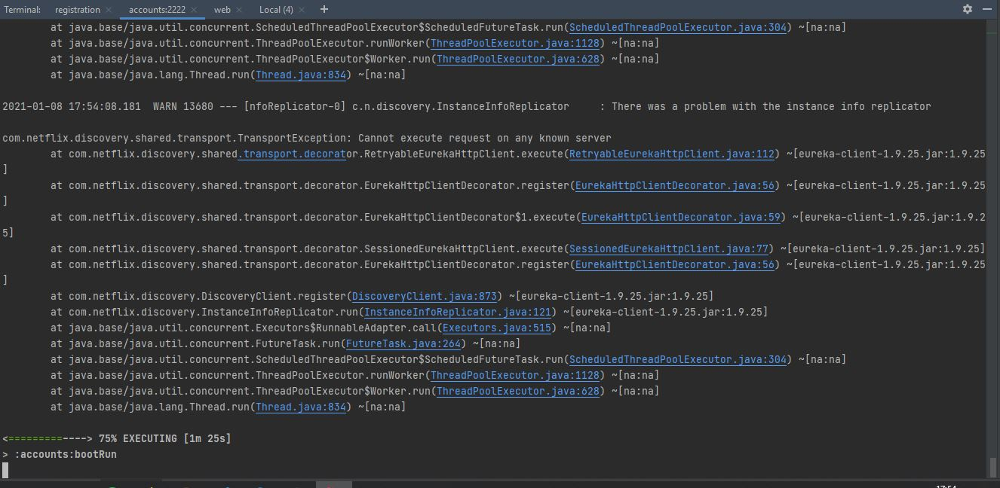
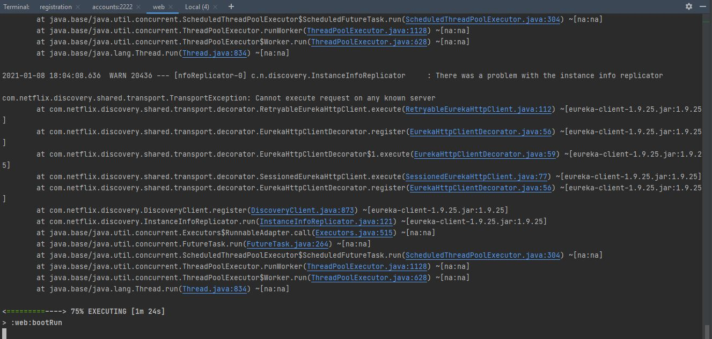
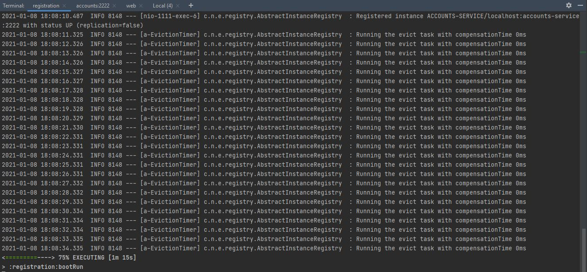
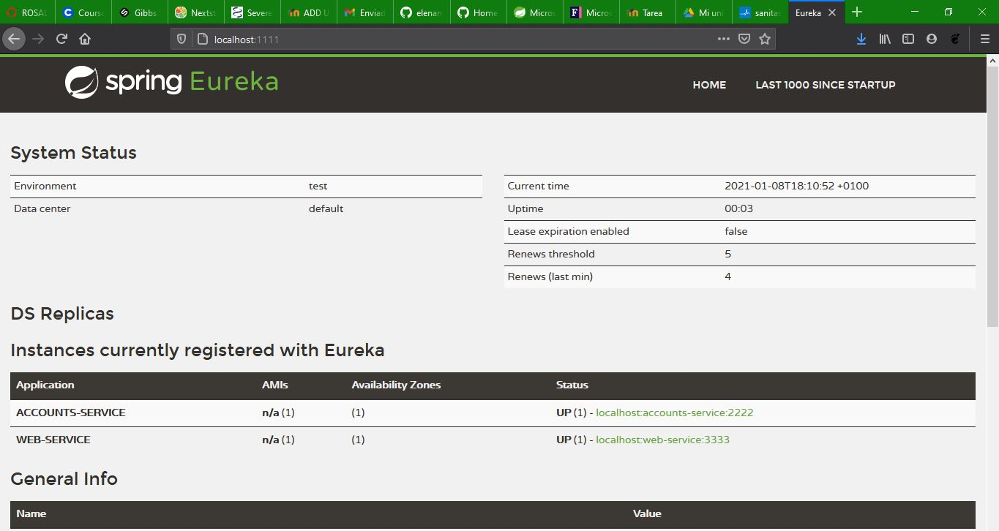
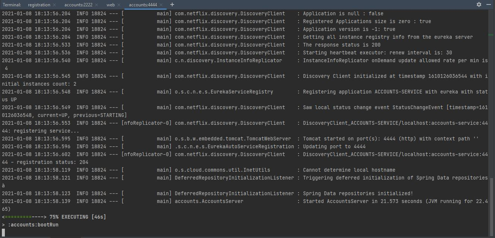
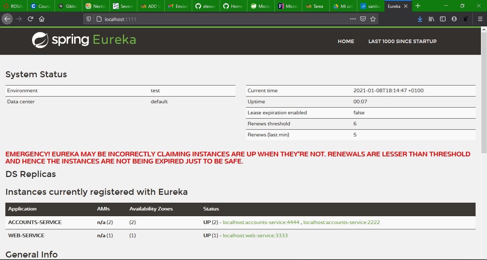
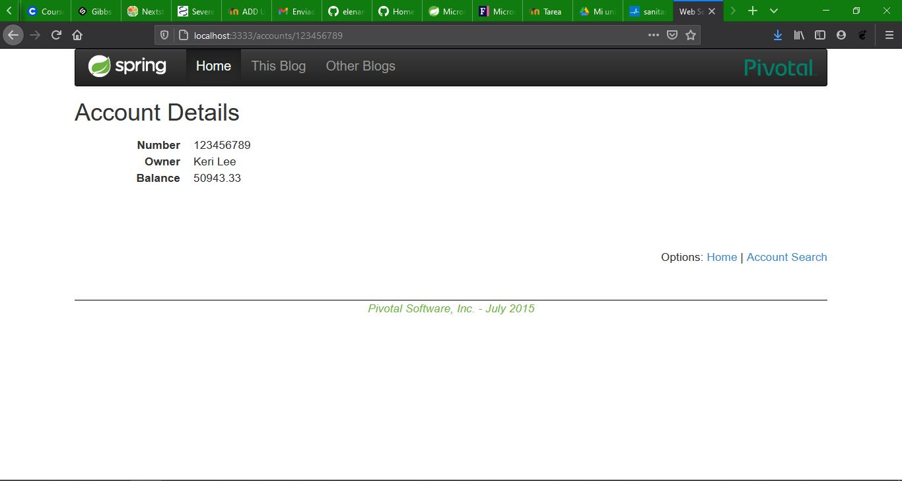
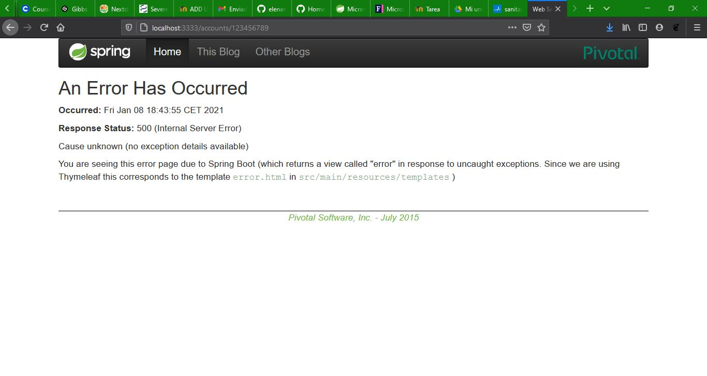
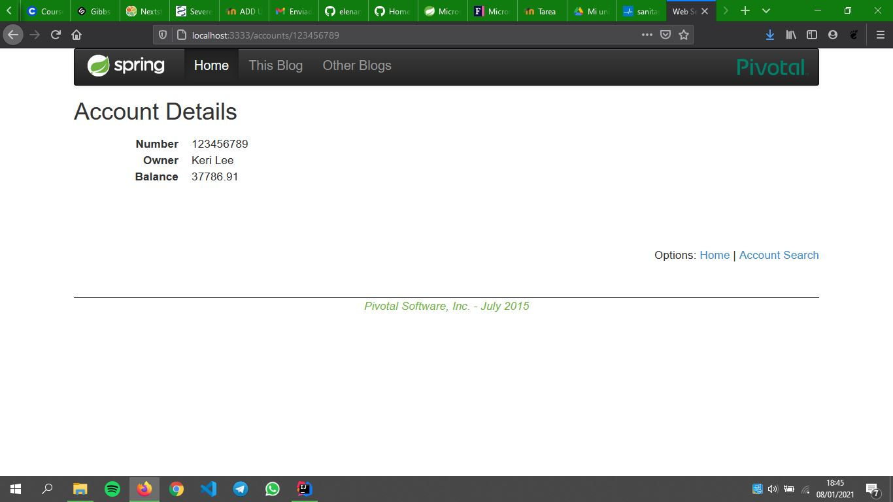

# Report L6
This is a brief report for lab 6 of Web Engineering subject.

* The two microservices `accounts (2222)` and `web` are running and registered (two terminals, logs screenshots).
  First, we run account service on port 2222. It tries to connect to Eureka server several times, always giving error as
  feedback.
  
  Then, we run web service on port 3333 with same result.
  

* The service registration service has these two microservices registered (a third terminal, dashboard screenshots)
  In order to allow to previous services the Eureka server they are waiting for, we run registered service on port
  1111. The first line we can read in the screenshot below is the connection of account service. After that, 
  Eureka server executes an eviction task each second.
  
  Meanwhile, in the dashboard, we observe we have 2 connections: account and web services with its directions.
  
  
* A second `accounts` microservice instance is started and will use the port 4444. This second `accounts (4444)` is also registered (a fourth terminal, log screenshots).
  In this case, we have a successful connection because registration service is up.  
  
  At the same time, we can see in the dashboard we have 2 account services actives.
  

* What happens when you kill the microservice `accounts (2222)` and do requests to `web`?
  On web client, before killing account:2222 service, we can see this response. 
  
  After killing it, we see this error message.
  
  
  
* Can the web service provide information about the accounts again? Why?
  Some minutes after killing the service, Eureka server is ready to redirect the service through the other account 
  service that is up. 
  